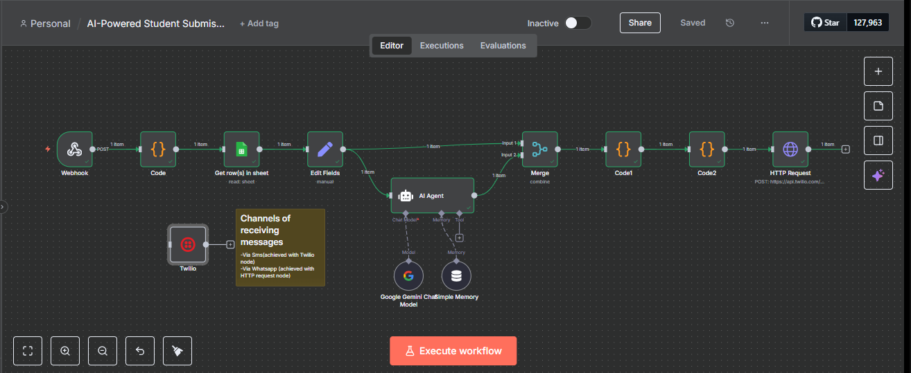

# RepoReady: AI-Powered Student Submission Notifier

An intelligent automation built with n8n that provides real-time, personalized
submission confirmations to bootcamp students via SMS or WhatsApp, enhancing the
learning experience and ensuring proper project delivery.

## Project Overview

As a tutor and data/software engineer for an AI/ML bootcamp(AAIF-African AI Foundry), I observed a common
pain point: students often felt uncertain after submitting their projects to GitHub
Classroom, and sometimes missed crucial steps (like pushing to the main branch).
This project addresses that by creating a seamless, automated notification system.

This agent eliminates the "bland" feeling of submission, provides instant confirmation,
and helps ensure students follow proper procedures by notifying them only upon
successful pushes to the default branch.

## Problem Statement

```
● Lack of Confirmation: Students lacked immediate feedback after pushing their
project code to GitHub, leaving them unsure if their submission was successful.
● Procedural Confusion: Some students might not follow due procedures (e.g.,
pushing to the correct branch), leading to invalid submissions without their
knowledge.
● Dull Experience: The act of pushing code didn't feel interactive for students and didn't acknowledge the student's effort.
```

## Solution

This project leverages n8n to create a robust, AI-powered workflow that triggers upon
a student's first push to their automatically created GitHub repository. It then fetches
student information, generates a personalized confirmation message using a Large
Language Model (LLM), and sends it directly to the student via their preferred
communication channel (SMS or WhatsApp).

## Workflow Diagram

Here's a visual representation of the n8n workflow:


## Technologies Used

```
● n8n: Workflow automation platform for orchestrating the entire process.
● GitHub Classroom: Manages student repositories and triggers webhook events on code pushes.
● Google Sheets: Stores student contact information (name, phone number) linked
to their GitHub usernames.
● Twilio: Powers SMS and WhatsApp messaging for notifications.
● Google Gemini (via n8n AI Agent node): Generates personalized confirmation
messages.
```

## How It Works

1. **GitHub Webhook Trigger:** The workflow starts when a student makes their first
   push to their assigned GitHub Classroom repository. GitHub sends a webhook
   payload to the n8n workflow.
2. **Code Node (Initial Processing):** Extracts key information from the GitHub
   webhook, such as repoFullName and githubUser.
3. **Google Sheets Lookup:** Uses the GitHubUsername to find the corresponding
   StudentName and Phone number in a Google Sheet.
4. **Edit Fields Node:** Consolidates relevant student and repository information
   (studentName, phoneNumber, repoFullName, githubUser) for downstream nodes.
5. **AI Agent (Google Gemini):** Takes the studentName and repoFullName as input
   and dynamically generates a friendly, personalized confirmation message.
6. **Merge Node:** Combines the student's personal details (from Google Sheets) with
   the AI-generated message (from the AI Agent) into a single data item, ensuring all
   necessary information is available for the notification.
7. **Code1 & Code2 Nodes:** Perform minor data normalization and phone number
   sanitization (e.g., adding a + prefix) to ensure the number is in E.164 format.
8. **Twilio / HTTP Request Node:**
   - **SMS:** Sends the personalized message via SMS using the Twilio node's SMS
     resource.
   - **WhatsApp:** Sends the personalized message via WhatsApp using the Twilio
     node's Custom API Call resource, formatted for the WhatsApp Business API.

## Setup and Configuration

To replicate this project, you'll need:

1. **n8n Instance:** A running n8n instance (cloud or self-hosted).
2. **GitHub Classroom Setup:** Ensure your GitHub Classroom is set up to create
   student repositories and that webhooks are configured to send push events to
   your n8n webhook URL.
3. **Google Sheet:** A Google Sheet with columns for GitHubUsername, StudentName,
   Phone, and Email.

4. **Twilio Account:** A Twilio account with an SMS-enabled phone number and a
   WhatsApp Sandbox (for testing WhatsApp messages).

**Step-by-Step Configuration in n8n:**

1. **Import the Workflow:**
   - Download the workflow.json file from this repository.
   - In your n8n instance, click "Add New" -> "Import from JSON" and upload the
     file.
2. **Configure Credentials:**
   - **Google Sheets:** Set up your Google Sheets credentials in n8n to allow access
     to your student data.
   - **Twilio:** Set up your Twilio credentials in n8n with your Account SID and Auth
     Token.
3. **Configure Nodes:**
   - **Webhook Node:**

     - \*Copy the webhook URL and configure your GitHub Classroom to send
       push events to this URL.

   - **Get row(s) in sheet Node:**
     - Link your Google Sheets credential.
     - Specify the Spreadsheet ID and Sheet Name where your student data is
       located.
   - **Edit Fields Node:**
     - Ensure the phoneNumber field is correctly mapped: ={{$node["Get row(s)
       in sheet"].json["Phone"]}}
     - Ensure other fields like studentName and repoFullName are also correctly
       mapped from their respective upstream nodes.
   - **AI Agent Node:**
     - Ensure it's connected to a Google Gemini Chat Model (or your preferred
       LLM).
     - The prompt should instruct it to generate a personalized message using
       studentName and repoFullName.
   - **Merge Node:**
     - **Mode:** Combine
     - **Combine By:** Position
     - This ensures the student's data and the AI-generated message are
       correctly merged into a single item.
   - **Code1 Node (Normalize AI Output):**
     const p = items[0].json || {};
     const message = p.generatedMessage ||

```js
p.text ||
p.output ||
p.content ||
(p.choices && p.choices[0] && (p.choices[0].text ||
(p.choices[0].message && p.choices[0].message.content))) ||
'';
return [{
json: {
...p, // Pass all original fields through
generatedMessage: message
}
}];
```

- **Code2 Node (Sanitize Phone Number):**
  const raw = (items[0].json.phoneNumber || '').toString().trim();
  let sanitized = raw;
  if (raw && !raw.startsWith('+')) {
  sanitized = '+' + raw;
  }
  return [{
  json: {
  ...items[0].json,
  sanitizedPhone: sanitized
  }
  }];

- **Twilio / HTTP Request Node (for SMS or WhatsApp):**
  - **For SMS (using the dedicated Twilio node):**
  - **Resource:** SMS
  - **From:** Your Twilio SMS-enabled phone number (e.g., +14783304581)
  - **To:** ={{$json["sanitizedPhone"]}}
  - **Message:** ={{$json["generatedMessage"]}}
  - **For WhatsApp (using the HTTP Request node for Custom API Call):**
  - **Method:** POST
  - **URL:**
    https://api.twilio.com/2010-04-01/Accounts/{YOUR_ACCOUNT_SID}/M
    essages.json (Replace {YOUR_ACCOUNT_SID} with your actual Twilio
    Account SID).
  - **Authentication:** Predefined credential type -> Select your Twilio credentials.

```
- Send Body: true
- Body Content Type: Form-urlencoded
- Body Parameters:
- To: whatsapp:{{$json["sanitizedPhone"]}}
- From: whatsapp:+14155238886 (Your Twilio WhatsApp Sandbox
number)
- Body: {{$json["generatedMessage"]}}
```

## Contribution

Feel free to fork this repository, suggest improvements, or open issues. Any
contributions are welcome!

## License

This project is licensed under the MIT License. See the LICENSE file for details.
